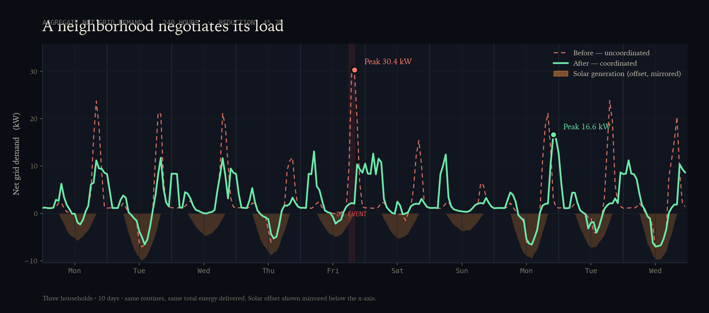
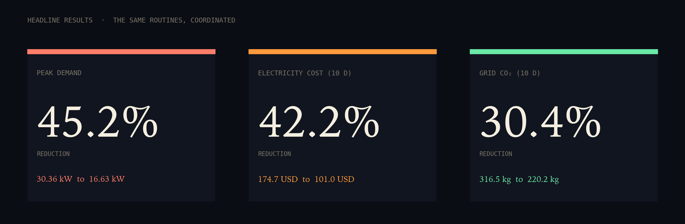
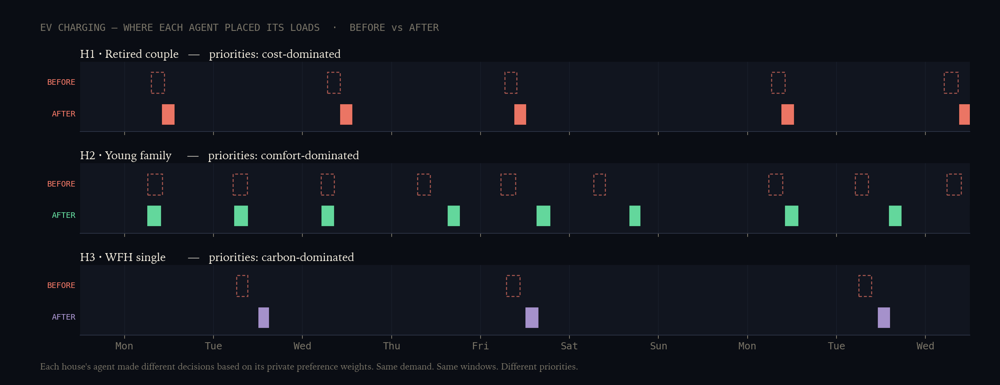

# HEMS — The Negotiated Grid

**A multi-agent home energy management system that flattens neighborhood peak demand by 45%, cuts electricity bills by 42%, and avoids 30% of grid CO₂ — without changing what anyone in the household actually does.**



Three smart homes, each with its own Ollama-powered LLM agent and *private* priorities, negotiate with a neighborhood coordinator over 10 simulated days. They reschedule EV charging, laundry, and water heating — same routines, same total energy delivered — and the grid stops seeing everyone hammering it at 7pm.

This is a working prototype, not a slide deck. The numbers below are measured outputs from the repo, not aspirations.

---

## Headline results



| | Before | After | Reduction |
|---|---:|---:|---:|
| Peak grid demand | 30.36 kW | 16.63 kW | **45.2%** |
| Electricity cost (10 d) | $174.74 | $101.00 | **42.2%** ($73.74) |
| Grid CO₂ (10 d) | 316.5 kg | 220.2 kg | **30.4%** (96.2 kg) |

Extrapolated to a month at the same daily pattern, that's roughly **$220 in household savings and 290 kg of CO₂ avoided** — for one neighborhood of three houses, with zero physical hardware changes.

---

## The problem

The grid was built for predictable industrial demand. We are now plugging in
*everything*: EVs (~7 kW per charger), heat pumps, induction stoves, AI
compute. US residential electricity demand is expected to grow 2–3× over the
next decade.

The grid cannot be physically rebuilt fast enough. Peaker plants — the
expensive, dirty natural gas turbines that fire up only during the worst
hours — already cost utilities billions and account for an outsized share of
emissions. The cheapest, fastest, and cleanest "new capacity" is *not*
building more capacity at all. It's coordinating the demand we already have.

The bottleneck is a **protocol** for coordinating millions of households that
don't share data, don't share a vendor, and don't trust a single optimizer
to plan their day. That's what this prototype is about.

---

## What we built

### A multi-agent simulator

- **Three house agents.** Each is a Python class wrapping an Ollama LLM
  call (`gpt-oss:120b-cloud` via the local Ollama daemon). Each agent has:
  - *Private* preference weights — cost / comfort / carbon / reliability —
    which the coordinator never sees.
  - A short personality string the LLM reads as flavor ("frugal retired
    engineer", "busy parents of two kids", "eco-conscious WFH consultant").
  - Its own physical system: H1 has no solar and no battery; H2 has 7.5 kW
    rooftop PV + 13.5 kWh battery; H3 has 4 kW solar only.
- **One coordinator agent.** Aggregates bids, computes a shadow-price signal
  (per-hour congestion in [0, 1]), and narrates each round in plain English.
- **A deterministic simulator** that computes the net grid demand
  (`base + shiftable − solar ± battery`), the dollar cost (TOU tariff), and
  the grid CO₂ (per-hour carbon intensity) for any schedule. It is the
  ground truth both agents and the UI rely on.

### A 4-phase negotiation

1. **Initial bids** — each house picks start times for its shiftable loads
   given flat prices, its private preferences, and its window constraints.
2. **Coordinator round** — sees the resulting curve, broadcasts the new
   per-hour price signal, flags any deadline-critical loads.
3. **Re-bid** — agents adjust based on the new prices (×3 rounds).
4. **Bilateral swaps** — pairs of agents evaluate direct peer-to-peer
   swap proposals against their *private* values, accepting or refusing
   with reasoned rationale in plain English.

A full run is roughly 12 LLM calls for the main rounds + up to 8 for
bilateral swaps, all wrapped in 3-retry exponential backoff so a single
cloud blip never kills a multi-minute negotiation.

---

## Why agents — and not just a solver

The decision to use LLM agents is **load-bearing**, not aesthetic. A
centralized optimizer with all the data could find a better mathematical
optimum. But the real grid doesn't have all the data — and never will.

What our agents demonstrate that a solver cannot:

1. **Privacy.** Each house only exposes a *bid*, never its preferences or
   personal context. The coordinator can't reverse-engineer a household's
   schedule, deadlines, or priorities from the price-response data.

2. **Heterogeneous priorities.** Three agents looking at *identical* price
   signals make *different* choices because they value different things:

   

   The frugal retiree shifts toward off-peak hours. The comfort-driven
   family avoids the middle of the night. The eco-conscious renter targets
   low-carbon hours. A single global solver collapses these into one
   objective function and loses the human judgment that makes the system
   acceptable to actual residents.

3. **Refusal.** During the bilateral swap phase, agents say *no* with
   reasons. From this run's transcript:

   > *"Comfort is the dominant priority (50%). The proposed shift stays
   > within the load's window but moves it to an hour that conflicts with
   > the household's bedtime baths."*

   > *"The move does not lower electricity cost — both the original and
   > proposed times fall in the peak tariff window."*

   A central solver can't be refused. An agent can. That's the difference
   between an opt-out tool and one residents will actually keep installed.

---

## Why this matters at scale

The market for grid-edge coordination is conservatively a $10B+ industry by
2030 — DERMS (Distributed Energy Resource Management), virtual power plants,
demand response programs, smart-EV-charging networks. Today it is dominated
by **proprietary, single-vendor stacks** (Tesla Powerwall talks to Tesla EV
talks to Tesla solar; nothing crosses the wall).

The opportunity is the open protocol layer: a standard for how a
neighborhood of heterogeneous houses (mixed vendors, mixed preferences,
mixed hardware) can coordinate **without surrendering private state and
without trusting a central operator**. That's exactly the problem shape
this prototype attacks.

LLM agents are the right abstraction because they can absorb messy,
narrative, household-specific context — "school run at 7:30am tomorrow",
"my dad has a CPAP machine, no power outages overnight" — that
rule-based DERMS products cannot model.

---

## See it run

The repo ships a working static UI that animates a 10-day playback of the
negotiation, including the bilateral-swap feed and a per-house solar +
battery state-of-charge ribbon.

```bash
git clone https://github.com/JainumSanghavi/HEMS.git
cd HEMS
python3 -m venv .venv
.venv/bin/pip install -r requirements.txt

# Optional: regenerate the dataset and rerun the negotiation
.venv/bin/python generate_rich_data.py    # builds data/neighborhood_rich.json
.venv/bin/python run_negotiation.py       # writes data/transcript_rich.json

# Serve the UI
.venv/bin/python -m http.server 8765
# open http://localhost:8765/ui/
```

Ollama must be running locally; the pipeline talks to
`http://localhost:11434` and uses `gpt-oss:120b-cloud` by default. To run
fully offline, set `OLLAMA_MODEL` to any locally-pulled model.

---

## Architecture

```
HEMS/
├── schema.py                # Pydantic models — HEMSData, House, Solar,
│                            #                   Battery, HouseholdPreferences,
│                            #                   Tariff, DREvent, ...
├── archetypes.py            # 24h base-load templates per household type
├── simulator.py             # Deterministic curve / cost / CO₂ engine
│
├── generate_rich_data.py    # Builds data/neighborhood_rich.json
│                            # (3 heterogeneous houses, 10 days, full signals)
│
├── agent_schemas.py         # I/O shapes for agents + the run transcript
├── house_agent.py           # HouseAgent: bid() + evaluate_swap()
├── coordinator.py           # CoordinatorAgent: integrate() + narrate()
├── bilateral_swap.py        # Post-round peer-to-peer swap phase
├── run_negotiation.py       # Orchestrator (asyncio)
│
├── generate_charts.py       # README chart renderer
├── docs/                    # Static PNGs (hero, headlines, diverged)
├── data/                    # Datasets + transcripts (rich + earlier 10-day)
└── ui/                      # index.html + styles.css + main.js
                             # Single-file static UI (D3.js v7 via CDN)
```

### Stack

- **Python 3.12** for the simulator, agents, and orchestrator
- **Pydantic 2** for schema validation in both directions of every LLM
  call (the `format=` parameter is treated as a hint, not a guarantee; we
  re-validate every response and structurally normalize field-name drift)
- **`ollama` Python client** with `AsyncClient` + `asyncio.gather()` for
  parallel agent calls
- **D3.js v7** + vanilla CSS + JS for the UI (no build chain, no React)
- **matplotlib** for the static README charts

### Resilience built in

Every LLM call (`bid`, `narrate`, `evaluate_swap`) is wrapped in a
3-retry-with-backoff loop. Every structured response is structurally
normalized to absorb the gpt-oss model's frequent field-name drift
(`load_schedule` → `load_bids`, `coordinator_message` → `message`, etc.)
and start-hour values outside their valid window are clamped before the
schedule is scored. A single bad LLM output cannot break a multi-minute
run.

---

## What this prototype is honest about

- **Three houses, ten days.** This is a demo, not a 100-house deployment.
  The architecture scales — every agent decision is local, every
  inter-agent message is bounded — but we have not run it at scale yet.
- **Battery dispatch is a deterministic default policy** (charge from
  solar surplus, discharge during peak tariff hours). Letting each house
  agent also reason about battery scheduling is a clear next step.
- **HVAC is out of scope.** It's the largest residential flexible load in
  most homes but requires a thermal-mass model we haven't built. Modeled
  as part of the static base load for now.
- **The negotiation runs offline and the UI plays the transcript.** Each
  LLM call takes 5–15 seconds, so a fully-live demo would freeze visibly
  between rounds. The transcript captures every message exactly as the
  agents produced it; nothing is fabricated for the visualization.

---

## Roadmap

- **More houses.** 10, then 100. The asyncio fan-out + coordinator
  topology should hold; coordination latency per round is what we'd watch.
- **Battery as an agent-decided resource.** Give the house agent direct
  control over charge/discharge with a small action space.
- **EV-as-battery (V2G).** Parked EVs become storage. This is research-
  grade today; nothing on the market commercializes it openly.
- **Coalition formation.** Houses bargain as blocs with the utility
  during demand-response events.
- **Real grid integration.** A utility-side bridge that consumes the
  coordinator's output and bids it into wholesale demand-response markets.

---

## Demo numbers, one more time

> Three smart homes. Each with its own LLM agent. Each with private
> priorities the coordinator never sees. Ten days of normal life. Same
> showers, same charged cars, same clean clothes.
>
> **45.2% less peak grid demand. 42.2% lower electricity bill. 30.4%
> less grid CO₂.**
>
> Built in a hackathon. Pushable to the real grid.
